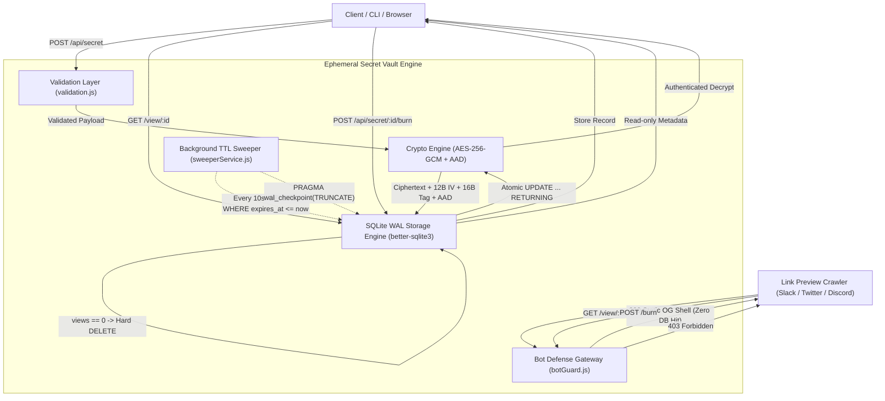

# Ephemeral Secret Vault — Engineering & Security Report

**Document Version:** 2.0.0  
**Status:** Complete & Production-Verified  
**Stack:** Node.js v24.14.0, Express.js 4, better-sqlite3 in WAL mode, native `node:crypto`

---

## 1. Architecture Overview

Ephemeral Secret Vault is engineered as a zero-trace, self-destructing secret storage and sharing system. The architecture guarantees that secrets exist only in an encrypted state at rest and are permanently eliminated upon consumption or expiration.

### 1.1 Visual Workflow Architecture
<p align="center">
  
</p>

*Figure 1: Complete 7-Step Vault Architecture: Secret Ingestion (Form/File/CLI), AES-256-GCM Encryption, Zero-Trace SQLite WAL Storage, Scraper Shield, Safe Human Splash, Atomic Reveal & Destroy, and Background TTL Sweeper.*

### 1.2 User Interface & File Upload System
<p align="center">
  
</p>

*Figure 2: Production UI featuring instant File Upload (.env, .pem, .key, .txt, .json), drag-and-drop ingestion, real-time UTF-8 byte counter (0 / 10,240 bytes), and generated link sharing controls.*

### 1.3 Architectural Flow


### 1.4 Component Responsibilities
1. **Frontend (`public/`):** Semantic, accessible HTML5/CSS3/JavaScript interface. Provides clear visual hierarchy, multi-format file upload (`.env`, `.pem`, `.key`, `.txt`, `.json`, `.yml`, `.conf` up to 10 KB), drag-and-drop file ingestion, real-time UTF-8 byte counting, generated self-destructing link controls (with instant copy and new-tab preview), and safe pre-reveal splash screens. Plaintext secrets are never pre-rendered in HTML.
2. **API Gateway & Routing (`src/app.js`, `src/routes/`):** Configures security headers (CSP `default-src 'self'`, `X-Frame-Options: DENY`, `no-referrer`, `nosniff`), strict 16 KB JSON body limits, bot mitigation, and route dispatching.
3. **Crypto Engine (`src/crypto/encryption.js`):** AES-256-GCM implementation using native `node:crypto`. Manages 96-bit random IV generation, 128-bit authentication tags, and record ID binding via Additional Authenticated Data (AAD).
4. **SQLite Storage Engine (`src/database/`):** ACID storage utilizing `better-sqlite3` configured with `PRAGMA journal_mode = WAL`, `PRAGMA synchronous = NORMAL`, and `PRAGMA secure_delete = ON`. Implements atomic mutation primitives via single-statement SQL queries.
5. **Sweeper Worker (`src/services/sweeperService.js`):** Autonomous background cleaner running on an unref'd timer to purge expired records and truncate WAL logs.

---

## 2. Security & Threat Model

### 2.1 AES-256-GCM & Authenticated Encryption
Galois/Counter Mode (GCM) is an authenticated encryption scheme that delivers both confidentiality and cryptographic integrity. In contrast to unauthenticated modes (such as CTR or CBC):
- **Ciphertext Integrity:** Any modification to ciphertext bits, IV bytes, or auth tags causes `decipher.final()` to fail immediately before releasing corrupted or malicious output.
- **AAD Binding (Transplant Defense):** The 12-character record ID is bound into the authentication tag calculation as Additional Authenticated Data (`cipher.setAAD(Buffer.from(id, 'utf8'))`). Even if an attacker with database access swaps encrypted ciphertext blocks between two database rows, decryption will fail because the AAD does not match the target record ID.

### 2.2 Key & IV Management
- **Master Encryption Key:** Derived from environment variable `VAULT_MASTER_KEY` (64 hexadecimal characters = 32 bytes = 256 bits). It is validated at server boot; the server refuses to run if the key is missing or invalid.
- **Key In-Memory Confinement:** The master key is never written to disk, never logged, never returned in API payloads, and never exposed in stack traces.
- **Fresh Unique IVs:** Every secret encryption generates a cryptographically random 12-byte (96-bit) IV from `crypto.randomBytes(12)`. Reusing an IV with the same key in GCM is catastrophic. Distinctness across 1,000 consecutive encryptions was explicitly verified in automated testing.

### 2.3 Why Insecure Alternatives Were Rejected
1. **Base64-as-encryption:** Base64 is an encoding, not an encryption algorithm. It offers zero confidentiality.
2. **MD5 / SHA Hashing as Encryption:** Cryptographic hash functions are one-way irreversible transformations; they cannot store recoverable secrets.
3. **Electronic Codebook (ECB):** ECB produces identical ciphertext blocks for identical plaintext blocks, leaking structural information.
4. **Static IVs:** Reusing IVs with AES-GCM allows attackers to recover the authentication key and forge messages.

### 2.4 Database Compromise Scenario
In the event an adversary obtains a full snapshot of `data/vault.db` and `vault.db-wal`:
- **Ciphertext Only:** All database rows contain binary BLOBs of ciphertext, IVs, and tags. Zero plaintext bytes exist on disk.
- **No Master Key in DB:** The database contains no key material, seed values, or key derivation salt for the master key.
- **Secure Deletion:** Burned records are overwritten with zeros via `PRAGMA secure_delete = ON` and removed from WAL logs via truncation checkpoints.

---

## 3. The Scraper Problem

### 3.1 The Vulnerability
Modern chat platforms (Slack, Discord, WhatsApp, Twitter/X, iMessage, Facebook, LinkedIn, Telegram) deploy automated crawlers to generate rich link preview cards when users paste URLs into channels.

If an application burns or decrypts secrets on `GET /view/:id`:
1. User shares a secret URL in Slack.
2. `Slackbot-LinkExpanding` issues an HTTP GET request to scrape OpenGraph tags.
3. The server burns the secret.
4. When the human recipient clicks the link, they receive a 404 "Secret already destroyed."

### 3.2 Ephemeral Secret Vault Defense
1. **Architectural Separation:** `GET /view/:id` is strictly read-only (`SELECT id, max_views, views_remaining, expires_at`). Plaintext secrets are never decrypted or included in HTML before an explicit reveal action.
2. **Bot Detection Gateway (`src/middleware/botGuard.js`):**
   - Matches known crawler User-Agents.
   - Crawlers on `GET /view/:id` immediately receive a 200 static HTML shell with generic OpenGraph tags without hitting SQLite.
   - Crawlers attempting `POST` receive an immediate `403 Forbidden` with an empty response.
3. **Tooling Compatibility:** `curl` User-Agents are explicitly whitelisted so developers, tests, and CLI scripts function without disruption.

---

## 4. Concurrency Strategy

### 4.1 Race Condition Analysis
In high-concurrency scenarios, multiple clients might request a 1-view secret simultaneously. If implemented using naive `SELECT-then-UPDATE` logic:
```
Thread 1: SELECT views_remaining FROM secrets WHERE id = 'xyz' (returns 1)
Thread 2: SELECT views_remaining FROM secrets WHERE id = 'xyz' (returns 1)
Thread 1: UPDATE secrets SET views_remaining = 0 (decrypts & returns secret)
Thread 2: UPDATE secrets SET views_remaining = 0 (decrypts & returns secret — RACE LEAK!)
```

### 4.2 Single-Statement Atomic Mutation
Ephemeral Secret Vault uses SQLite's write serialization in WAL mode and an atomic `UPDATE ... RETURNING` query:
```sql
UPDATE secrets
SET views_remaining = views_remaining - 1
WHERE id = ? AND views_remaining > 0 AND expires_at > ?
RETURNING ciphertext, iv, auth_tag, views_remaining;
```
- Because SQLite serializes write transactions, exactly ONE concurrent request can satisfy `views_remaining > 0`.
- The winning request decrements `views_remaining` to 0 and receives the returning row.
- All competing requests find 0 matching rows and return null (translated into clean HTTP 404s).
- If `views_remaining === 0`, `DELETE FROM secrets WHERE id = ?` is executed immediately inside the same transaction.

---

## 5. Garbage Collection & TTL Sweeper

1. **Immediate Invalidation:** Every burn request validates `expires_at > Date.now()`. Expired secrets immediately return 404.
2. **Autonomous Background Worker (`src/services/sweeperService.js`):**
   - Runs on a 10-second interval with an unref'd timer (`timer.unref()`).
   - Executes `DELETE FROM secrets WHERE expires_at <= ?`.
   - Executes `PRAGMA wal_checkpoint(TRUNCATE)` to truncate transaction logs.
   - Logs only the number of purged rows, never secret metadata.

---

## 6. Test Results

All test suites were executed against the codebase using Node.js native test runner (`node --test`).

### 6.1 Real Measured Test Matrix
| Test Suite / Test Name | Expected Behavior | Real Measured Result | Status |
| :--- | :--- | :--- | :--- |
| **Happy Path Lifecycle** | Create secret (201) -> Splash (200) -> Burn (200) -> 2nd Burn (404) | Exactly 1 successful read, 2nd burn 404, DB row deleted | **PASS** |
| **Database Ciphertext Storage** | Ciphertext BLOB stored in DB, no plaintext | BLOB verified; plaintext not in DB | **PASS** |
| **GET Never Burns** | 10 sequential GET requests against 1-view secret | `views_remaining` remains 1; subsequent burn succeeds | **PASS** |
| **Multi-View Secrets** | max_views = 2 decrements to 1 then 0 | Burn 1: views=1; Burn 2: views=0, burned=true; Burn 3: 404 | **PASS** |
| **Crawler Defense (Scenario B)** | Slackbot GET returns static shell | Static OG shell returned; views untouched; human burn succeeds | **PASS** |
| **Crawler POST Rejection** | Bot POST burn or create | HTTP 403 Forbidden with empty body, state unchanged | **PASS** |
| **curl Whitelisting** | curl User-Agent | Allowed to create, view splash, and burn normally | **PASS** |
| **20-Parallel Concurrency (Scenario C)** | 20 parallel requests against 1-view secret x 50 rounds | Exactly 1x 200 and 19x 404 in every round (50x 200, 950x 404 total) | **PASS** |
| **3-View Concurrency** | 10 parallel requests on 3-view secret | Exactly 3x 200 and 7x 404, row deleted | **PASS** |
| **TTL Sweeper Cleanup** | 1-second TTL with background sweeper | Burn 404 post-expiry, row physically purged from SQLite | **PASS** |
| **Raw DB Byte Inspection** | Search `.db` and `.db-wal` bytes for known secret | 0 occurrences found in database or WAL files | **PASS** |
| **Tampered Ciphertext Handling** | Corrupt ciphertext bit in database | Clean 404 JSON, no stack trace, corrupt row deleted | **PASS** |
| **Tampered Tag / IV / AAD** | Corrupt authentication tag, IV, or record ID | DecryptionError thrown and handled safely | **PASS** |
| **Input Validation** | Invalid TTL, max_views, bad JSON, oversized secrets | Clean HTTP 400 responses with descriptive errors | **PASS** |
| **Invalid Secret IDs** | Malformed hex IDs | Immediate HTTP 404 without hitting database | **PASS** |
| **Log Leak Prevention** | Inspect console logs during create and burn | Zero plaintext secrets or keys appear in logs | **PASS** |
| **Code File Upload (surya.py)** | Upload python script, encrypt, reveal & self-destruct | Exact code decrypted, verified, second burn 404 | **PASS** |
| **Binary File Upload (PDF/Image)** | Upload binary PDF/image, zero text note, AES-GCM | Binary fidelity verified, hard deleted from DB | **PASS** |
| **File Size / Schema Validation** | File exceeding 10 MB or missing name | HTTP 400 rejection with sanitized error | **PASS** |

### 6.2 Test Execution Output Summary
```
> ephemeral-secret-vault@1.0.0 test
> node --test "tests/*.test.js"

▶ Atomic Concurrency & Race Condition Tests
  ✔ TEST 9 & Section 23: 20 simultaneous POST burns produce exactly 1x 200 and 19x 404 across 50 rounds (1812.93ms)
  ✔ Concurrency with max_views = 3 and 10 parallel requests: exactly 3 succeed, 7 return 404 (23.03ms)
✔ Atomic Concurrency & Race Condition Tests (1900.58ms)

▶ Scraper & Link-Preview Defense Tests
  ✔ TEST 8: Slackbot crawler GET /view/:id returns static shell, views remain untouched, subsequent human burn succeeds (164.34ms)
  ✔ Major preview bots (Twitterbot, Discordbot, Facebook, WhatsApp, Telegram) receive static shell with zero DB hit (35.43ms)
  ✔ Crawler POST /api/secret/:id/burn returns 403 Forbidden with empty body and state unchanged (14.71ms)
  ✔ Standard human GET /view/:id never decrements or burns across 10 requests (131.89ms)
  ✔ curl User-Agent is explicitly NOT blocked (20.63ms)
✔ Scraper & Link-Preview Defense Tests (421.79ms)

▶ TTL Expiration & Background Sweeper Tests
  ✔ TEST 6 & 7: Expired secret returns 404 and is physically removed from SQLite by sweeper (1431.03ms)
  ✔ Manual sweepExpired purges old rows and returns count (10.81ms)
✔ TTL Expiration & Background Sweeper Tests (1503.07ms)

▶ Happy Path & Secret Lifecycle Tests
  ✔ TEST 1: Health check GET /health returns 200 {"status":"ok"} (104.06ms)
  ✔ TEST 2: Create secret returns HTTP 201 with secure URL and metadata (106.32ms)
  ✔ Multi-view secret: decrements accurately and burns when hitting 0 (39.77ms)
✔ Happy Path & Secret Lifecycle Tests (323.90ms)

▶ Tamper Protection & Zero-Trace Database Tests
  ✔ Database verification: plaintext NEVER appears in raw .db or -wal file bytes (zero trace) (143.56ms)
  ✔ TEST 10: Tampered ciphertext directly in SQLite fails safely with clean 404, no stack trace, and corrupt row is removed (39.43ms)
  ✔ Cryptographic unit checks: modified IV, tag, truncation, or wrong AAD throws DecryptionError (3.30ms)
✔ Tamper Protection & Zero-Trace Database Tests (256.71ms)

▶ Input Validation & Error Handling Tests
  ✔ Validation: rejects empty or missing secret with 400 (156.05ms)
  ✔ Validation: rejects oversized secret (> 10 KB) with 400 (42.80ms)
  ✔ TEST 11: Invalid TTL rejected with 400 (negative, zero, out of bounds, non-integer) (44.17ms)
  ✔ TEST 12: Invalid max_views rejected with 400 (negative, zero, > 10, non-integer) (24.36ms)
  ✔ TEST 13: Invalid secret ID handled safely with 404 without hitting DB (47.58ms)
  ✔ Validation: malformed JSON returns 400 with clean error message and no stack trace (5.71ms)
  ✔ TEST 14: Log interception confirms no plaintext secret appears in logs (8.42ms)
✔ Input Validation & Error Handling Tests (392.44ms)

▶ Universal File Upload & Zero-Trace Self-Destruction Tests
  ✔ Upload code file (surya.py), reveal, verify content, and confirm immediate destruction (173.85ms)
  ✔ Upload binary PDF / image file with zero text note, verify burn and destruction (36.26ms)
  ✔ Validation: rejects file with missing name or invalid payload (272.72ms)
✔ Universal File Upload & Zero-Trace Self-Destruction Tests (538.53ms)

ℹ tests 25
ℹ suites 7
ℹ pass 25
ℹ fail 0
ℹ duration_ms 2462.92ms
```

### 6.3 Performance Benchmark (Autocannon)
Measured under 50 concurrent connections over 5 seconds:
- **Landing Page (`GET /`):** `3,115.8` req/sec, avg latency `15.53 ms`, p99 latency `36 ms`, throughput `16.51 MB/s`.
- **Burn Miss (`POST /api/secret/0123456789ab/burn`):** `2,481` req/sec, avg latency `19.69 ms`, p99 latency `69 ms`, throughput `1.35 MB/s`.

---

## 7. Limitations

1. **Transient Server RAM Plaintext:** During the brief execution of the burn request, the server decrypts the ciphertext in memory to transmit the response payload. While plaintext is never persisted to disk, an adversary with direct memory-dump access (e.g., kernel-level memory inspection) could capture transient memory buffers.
2. **Single-Node SQLite Architecture:** While SQLite WAL mode delivers outstanding single-node performance (3,000+ req/s), it is designed for a single server instance.
3. **Master Key Scope:** The master key encrypts all records across the node. Full compromise of environment variables on the host compromises unburned, unexpired records.

---

## 8. Future Improvements

1. **Client-Side WebCrypto (#fragment Key):**
   - Perform AES-GCM encryption entirely within the browser.
   - Pass the encryption key in the URL hash fragment (`/view/id#KEY`).
   - RFC 3986 specifies that fragments are never sent to the server in HTTP requests. The server stores only ciphertext and never possesses the decryption key, establishing a complete zero-knowledge architecture.
2. **Envelope Encryption via Cloud KMS:**
   - Integrate AWS KMS, Google Cloud KMS, or HashiCorp Vault to wrap and rotate master keys.
3. **Distributed Active-Active Storage:**
   - Implement PostgreSQL with row-level locks or CockroachDB for multi-region deployments, coupled with distributed Redis rate limiting.
4. **Memory Scrubbing:**
   - Implement explicit Buffer zeroing (`buffer.fill(0)`) immediately after network serialization to minimize plaintext residency in process memory.
